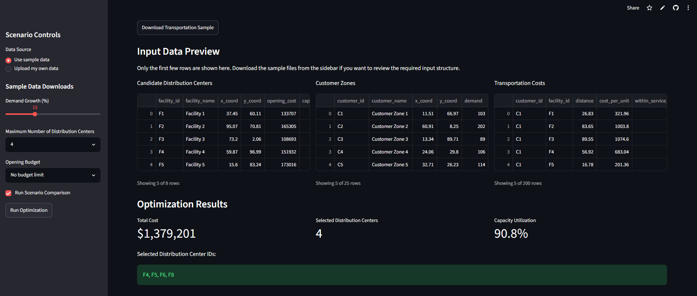
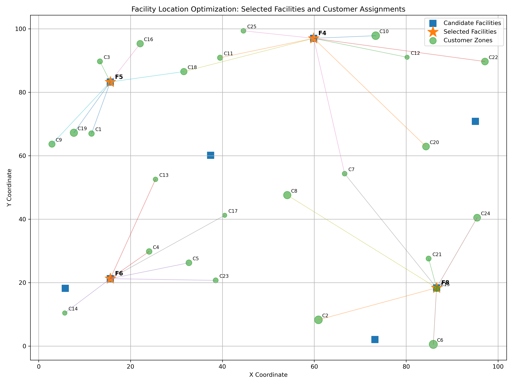

# Project 1: Facility Location Optimization for Distribution Network Planning

## Project Overview

This project solves a facility location optimization problem for a distribution network. The goal is to decide which candidate facilities should be opened and how customer zones should be assigned to those facilities while minimizing total cost and satisfying operational constraints.

The project is designed as an Operations Research portfolio project and includes synthetic data generation, mathematical optimization, scenario analysis, visualization, and an interactive Streamlit dashboard.

## Business Problem

A company wants to expand or redesign its distribution network. Several candidate facility locations are available, but opening each facility has a fixed cost and limited capacity. Customer zones have different demand levels and must be assigned to open facilities.

The main business question is:

> Which facilities should be opened, and how should customers be assigned, to minimize total cost while satisfying demand, capacity, and service constraints?

## Live App

The interactive Streamlit dashboard is available here:

[Open the Facility Location Optimization App](https://operations-research-portfolio-ueoa43qcwfib95zqqgfnd7.streamlit.app/)

## Dashboard Preview

## Optimization Result Example

## Optimization Approach

This project uses a Mixed-Integer Linear Programming model.

### Decision Variables

- Whether each candidate facility is opened
- Whether each customer zone is assigned to a facility

### Objective Function

Minimize total cost, including:

- Facility opening costs
- Transportation or assignment costs

### Constraints

The model includes constraints for:

- Customer demand satisfaction
- Facility capacity limits
- Maximum number of facilities
- Budget limit
- Service distance or assignment feasibility
- Demand growth scenarios

## Mathematical Formulation

### Sets

Let:

- $I$ = set of candidate facility locations
- $J$ = set of customer zones

### Parameters

- $f_i$ = fixed opening cost of facility $i$
- $c_{ij}$ = transportation or assignment cost from facility $i$ to customer $j$
- $d_j$ = demand of customer zone $j$
- $q_i$ = capacity of facility $i$
- $B$ = available budget
- $K$ = maximum number of facilities allowed
- $a_{ij}$ = 1 if facility $i$ can serve customer $j$, 0 otherwise

### Decision Variables

- $y_i \in \{0,1\}$: 1 if facility $i$ is opened, 0 otherwise
- $x_{ij} \in \{0,1\}$: 1 if customer $j$ is assigned to facility $i$, 0 otherwise

### Objective Function

Minimize total cost:

$$
\min \sum_{i \in I} f_i y_i + \sum_{i \in I}\sum_{j \in J} c_{ij} d_j x_{ij}
$$

The first term represents facility opening costs, and the second term represents demand-weighted assignment or transportation costs.

### Constraints

Each customer must be assigned to exactly one facility:

$$
\sum_{i \in I} x_{ij} = 1 \quad \forall j \in J
$$

Customers can only be assigned to open facilities:

$$
x_{ij} \leq y_i \quad \forall i \in I, j \in J
$$

Facility capacity cannot be exceeded:

$$
\sum_{j \in J} d_j x_{ij} \leq q_i y_i \quad \forall i \in I
$$

The number of selected facilities cannot exceed the allowed limit:

$$
\sum_{i \in I} y_i \leq K
$$

Total facility opening cost must stay within the available budget:

$$
\sum_{i \in I} f_i y_i \leq B
$$

Assignments are only allowed when a facility can serve a customer within the service-distance limit:

$$
x_{ij} \leq a_{ij} \quad \forall i \in I, j \in J
$$

Binary decision variables:

$$
y_i \in \{0,1\} \quad \forall i \in I
$$

$$
x_{ij} \in \{0,1\} \quad \forall i \in I, j \in J
$$

### Demand Growth Scenario

For scenario analysis, customer demand can be adjusted using a demand growth rate $g$:

$$
d_j^{scenario} = d_j(1 + g)
$$

where $g$ represents the selected demand growth percentage.
## Data

The project uses synthetic datasets representing:

- Candidate facility locations
- Customer zones
- Customer demand
- Facility opening costs
- Facility capacities
- Transportation costs or distances

The Streamlit app allows users to preview sample input data, download sample datasets, and upload their own data.

## Scenario Analysis

The project supports scenario testing for different operational assumptions, including:

- Demand growth percentage
- Maximum number of facilities allowed
- Budget limits
- Facility capacity changes
- Service distance limitations

The app compares the optimized solution under different parameter settings and reports whether each scenario is feasible or infeasible.

## Interactive Dashboard

The Streamlit dashboard allows a stakeholder to:

- Upload custom input data
- Download sample datasets
- Preview input data
- Adjust optimization parameters
- Run the optimization model
- View selected facilities
- View customer assignments
- View total cost
- Analyze scenario results
- Visualize facilities and customer zones on a plot

## Tools and Libraries

- Python
- Pandas
- NumPy
- PuLP
- Streamlit
- Matplotlib

## Key Outputs

The optimization model produces:

- Solver status
- Total optimized cost
- Selected facility locations
- Customer-to-facility assignments
- Facility utilization
- Scenario comparison results
- Feasibility or infeasibility messages

## Project Value

This project demonstrates the use of Operations Research and optimization modeling for strategic network design. It shows how mathematical programming can support facility planning decisions and how an interactive dashboard can make optimization results easier for stakeholders to understand.

## Resume-Ready Summary

Developed a mixed-integer facility location optimization model in Python to select cost-minimizing facility locations under demand, capacity, budget, and service constraints. Built an interactive Streamlit dashboard enabling users to upload data, adjust scenario parameters, visualize selected facilities, and evaluate feasibility under changing demand and budget conditions.
