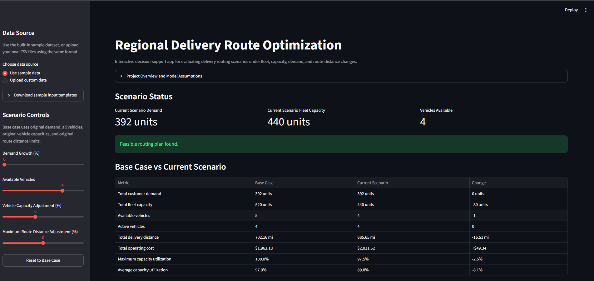
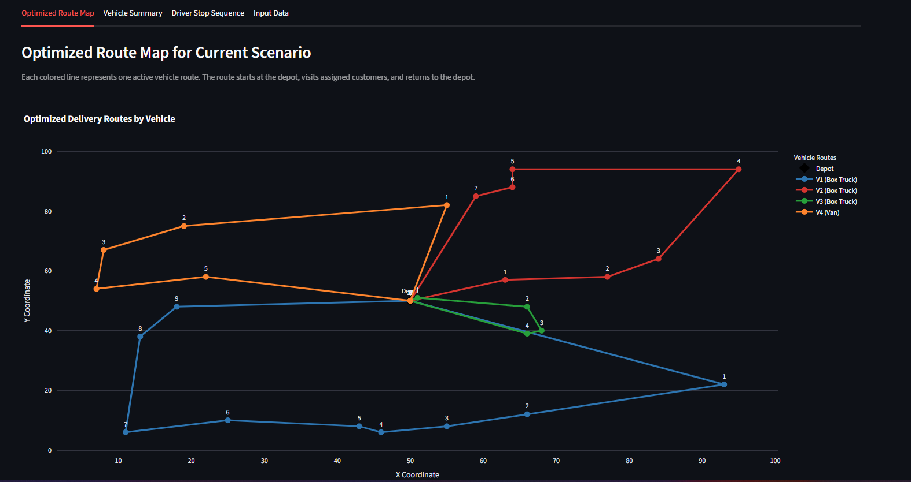
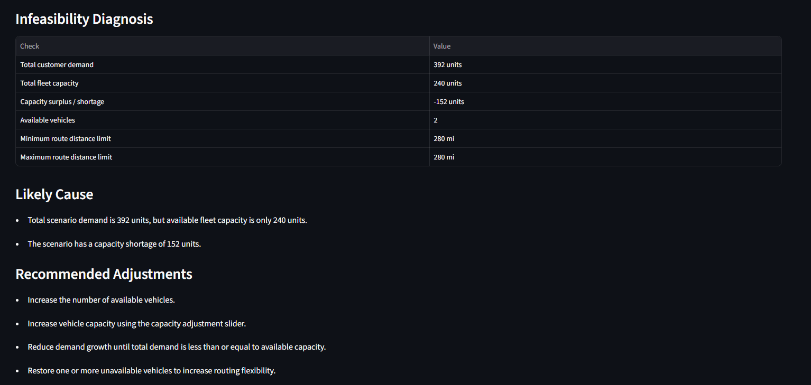

# Regional Delivery Route Optimization for Multi-Vehicle Fleet Planning

## Live App

Streamlit dashboard: **[Launch App](PASTE_STREAMLIT_APP_LINK_HERE)**

> Replace the placeholder above with your Streamlit app link after deployment.

---

## Project Overview

This project develops an Operations Research decision-support tool for a regional delivery operation. The goal is to assign customer deliveries to a limited fleet of vehicles while minimizing total operating cost and satisfying vehicle capacity and route-distance constraints.

The project includes:

* Synthetic delivery logistics data
* Capacitated Vehicle Routing Problem (CVRP) formulation
* Python implementation using OR-Tools
* Scenario analysis for demand growth, fleet size, vehicle capacity, and route limits
* Interactive Streamlit dashboard for stakeholder decision support
* Downloadable route plans and scenario outputs
* Infeasibility diagnosis for operational planning

This project is designed as part of an Operations Research portfolio to demonstrate routing optimization, scenario analysis, and stakeholder-facing analytics.

---

## Dashboard Preview

### Main Dashboard



### Optimized Route Map



### Scenario Cost Comparison


### Scenario Utilization Comparison


### Infeasibility Diagnosis



---

## Business Problem

A regional logistics team must deliver products from a central depot to multiple customer locations. Each customer has a known demand, and each vehicle has a capacity limit, fixed operating cost, cost per mile, and maximum route-distance limit.

The company wants to answer questions such as:

* Which vehicle should serve each customer?
* In what order should customers be visited?
* How many vehicles are needed?
* What is the total operating cost?
* What happens if demand increases?
* What happens if fewer vehicles are available?
* What changes can make an infeasible delivery scenario feasible again?

The optimization model helps planners create cost-effective delivery routes while maintaining operational feasibility.

---

## Operations Research Model

This project is modeled as a **Capacitated Vehicle Routing Problem (CVRP)** with route-distance limits and vehicle-specific operating costs.

---

### Sets

Let:

* $N$ = set of all nodes, including the depot and customers
* $C$ = set of customer nodes
* $K$ = set of available vehicles
* $0$ = depot node

where:

$$N = C \cup {0}$$

---

### Parameters

| Parameter | Description                                    |
| --------- | ---------------------------------------------- |
| $d_{ij}$  | Distance from node $i$ to node $j$             |
| $q_i$     | Demand at customer $i$                         |
| $Q_k$     | Capacity of vehicle $k$                        |
| $F_k$     | Fixed cost of using vehicle $k$                |
| $c_k$     | Cost per mile for vehicle $k$                  |
| $L_k$     | Maximum route distance allowed for vehicle $k$ |

---

### Decision Variables

The routing decision variable is:

$$x_{ijk} \in \lbrace 0,1 \rbrace$$

where:

* $x_{ijk} = 1$ if vehicle $k$ travels directly from node $i$ to node $j$
* $x_{ijk} = 0$ otherwise

The vehicle-use decision variable is:

$$y_k \in \lbrace 0,1 \rbrace$$

where:

* $y_k = 1$ if vehicle $k$ is used
* $y_k = 0$ otherwise

The customer-assignment variable is:

$$z_{ik} \in \lbrace 0,1 \rbrace$$

where:

* $z_{ik} = 1$ if customer $i$ is served by vehicle $k$
* $z_{ik} = 0$ otherwise

---

### Objective Function

The objective is to minimize total operating cost, including fixed vehicle usage costs and distance-based travel costs:

$$\min \left[ \sum_{k \in K} F_k y_k + \sum_{k \in K} \sum_{i \in N} \sum_{j \in N} c_k d_{ij} x_{ijk} \right]$$

---

### Constraints

Each customer must be assigned to exactly one vehicle:

$$\sum_{k \in K} z_{ik} = 1 \qquad \forall i \in C$$

Each customer must be visited exactly once:

$$\sum_{k \in K} \sum_{j \in N} x_{jik} = 1 \qquad \forall i \in C$$

Each used vehicle must leave the depot:

$$\sum_{j \in C} x_{0jk} = y_k \qquad \forall k \in K$$

Each used vehicle must return to the depot:

$$\sum_{i \in C} x_{i0k} = y_k \qquad \forall k \in K$$

Flow conservation must hold for each vehicle and customer node:

$$\sum_{i \in N} x_{ihk} = \sum_{j \in N} x_{hjk} \qquad \forall h \in C,\ \forall k \in K$$

Vehicle capacity cannot be exceeded:

$$\sum_{i \in C} q_i z_{ik} \leq Q_k \qquad \forall k \in K$$

Vehicle route-distance limits must be respected:

$$\sum_{i \in N} \sum_{j \in N} d_{ij} x_{ijk} \leq L_k \qquad \forall k \in K$$

Decision variables are binary:

$$x_{ijk} \in \lbrace 0,1 \rbrace \qquad \forall i,j \in N,\ \forall k \in K$$

$$y_k \in \lbrace 0,1 \rbrace \qquad \forall k \in K$$

$$z_{ik} \in \lbrace 0,1 \rbrace \qquad \forall i \in C,\ \forall k \in K$$

Subtour elimination and route continuity are handled internally by the OR-Tools routing solver.

---

## Dataset

The project uses a synthetic logistics dataset representing a regional delivery operation.

### Input Files

| File                  | Description                                                          |
| --------------------- | -------------------------------------------------------------------- |
| `depot.csv`           | Central depot location                                               |
| `customers.csv`       | Customer locations, demand, zone, priority, and service time         |
| `vehicles.csv`        | Fleet capacity, fixed cost, cost per mile, and route-distance limits |
| `distance_matrix.csv` | Pairwise travel distance between depot and customers                 |

---

### Main Input Fields

#### `depot.csv`

| Column       | Description      |
| ------------ | ---------------- |
| `depot_id`   | Depot identifier |
| `depot_name` | Depot name       |
| `x_coord`    | X-coordinate     |
| `y_coord`    | Y-coordinate     |

#### `customers.csv`

| Column             | Description            |
| ------------------ | ---------------------- |
| `customer_id`      | Customer identifier    |
| `customer_name`    | Customer name          |
| `zone`             | Customer delivery zone |
| `x_coord`          | X-coordinate           |
| `y_coord`          | Y-coordinate           |
| `demand_units`     | Customer demand        |
| `priority_level`   | Delivery priority      |
| `service_time_min` | Estimated service time |

#### `vehicles.csv`

| Column               | Description                    |
| -------------------- | ------------------------------ |
| `vehicle_id`         | Vehicle identifier             |
| `vehicle_type`       | Vehicle type                   |
| `capacity_units`     | Vehicle capacity               |
| `fixed_cost`         | Fixed cost if vehicle is used  |
| `cost_per_mile`      | Distance-based operating cost  |
| `max_route_distance` | Maximum allowed route distance |

#### `distance_matrix.csv`

| Column           | Description              |
| ---------------- | ------------------------ |
| `from_id`        | Origin node              |
| `to_id`          | Destination node         |
| `distance_miles` | Travel distance in miles |

---

## Project Workflow

The project follows the workflow below:

1. Generate synthetic depot, customer, vehicle, and distance data.
2. Build a distance matrix from customer and depot coordinates.
3. Formulate and solve a CVRP using OR-Tools.
4. Extract vehicle-level and stop-level route outputs.
5. Visualize optimized routes using Plotly.
6. Run scenario analysis.
7. Build an interactive Streamlit dashboard.
8. Allow stakeholders to download sample inputs, upload custom files, test scenarios, and download route outputs.

---

## Repository Structure

```text
02_regional_delivery_route_optimization/
│
├── app/
│   └── streamlit_app.py
│
├── assets/
│   ├── app_main.png
│   ├── route_map.png
│   ├── scenario_cost_comparison.png
│   ├── scenario_utilization_comparison.png
│   └── infeasibility_diagnosis.png
│
├── data/
│   ├── depot.csv
│   ├── customers.csv
│   ├── vehicles.csv
│   ├── distance_matrix.csv
│   ├── optimized_routes.csv
│   └── route_summary.csv
│
├── outputs/
│   ├── route_map.html
│   ├── scenario_results.csv
│   ├── scenario_cost_comparison.html
│   ├── scenario_distance_comparison.html
│   ├── scenario_utilization_comparison.html
│   └── scenarios/
│
├── src/
│   ├── generate_vrp_data.py
│   ├── solve_vrp.py
│   ├── plot_routes.py
│   ├── run_scenario_analysis.py
│   └── plot_scenario_results.py
│
├── README.md
└── requirements.txt
```

---

## Scenario Analysis

Scenario analysis was used to evaluate how the routing plan changes under different operational conditions.

### Tested Scenarios

| Scenario          | Description                                                           |
| ----------------- | --------------------------------------------------------------------- |
| Base Case         | Original demand, full fleet, original capacity, original route limits |
| Demand Growth 10% | Customer demand increased by 10%                                      |
| Demand Growth 20% | Customer demand increased by 20%                                      |
| Reduced Fleet     | One vehicle removed from the available fleet                          |
| Tight Route Limit | Maximum route distance reduced                                        |
| Expanded Capacity | Vehicle capacity increased by 15%                                     |

---

### Scenario Results

| Scenario          | Feasible | Total Demand | Fleet Capacity | Active Vehicles | Total Distance | Total Cost | Avg. Utilization | Max Utilization |
| ----------------- | -------: | -----------: | -------------: | --------------: | -------------: | ---------: | ---------------: | --------------: |
| Base Case         |      Yes |          392 |            520 |               4 |      702.16 mi |  $1,962.18 |            97.9% |          100.0% |
| Demand Growth 10% |      Yes |          433 |            520 |               4 |      685.56 mi |  $2,029.77 |            98.6% |          100.0% |
| Demand Growth 20% |      Yes |          470 |            520 |               5 |      768.63 mi |  $2,213.10 |            90.3% |           96.7% |
| Reduced Fleet     |      Yes |          392 |            440 |               4 |      685.65 mi |  $2,011.53 |            89.8% |           97.5% |
| Tight Route Limit |      Yes |          392 |            520 |               4 |      696.70 mi |  $2,061.80 |            88.0% |           96.7% |
| Expanded Capacity |      Yes |          392 |            598 |               4 |      642.06 mi |  $1,845.91 |            82.9% |           96.4% |

---

### Key Findings

* The base case served 392 delivery units using 4 active vehicles.
* Under 10% demand growth, the fleet remained feasible but operated near full utilization.
* Under 20% demand growth, all 5 vehicles were required.
* The reduced-fleet scenario remained feasible but increased operating cost.
* Tightening route-distance limits increased cost because the solver had less routing flexibility.
* Expanding vehicle capacity by 15% produced the lowest operating cost and shortest delivery distance.

---

## Streamlit Dashboard

The project includes an interactive Streamlit dashboard for stakeholder-facing scenario analysis.

### Dashboard Features

The dashboard allows users to:

* Use the sample dataset or upload custom CSV files
* Download sample input templates
* Check uploaded data format compatibility
* Adjust demand growth
* Adjust number of available vehicles
* Adjust vehicle capacity
* Adjust maximum route distance limits
* Reset all controls to the base case
* Compare base case versus current scenario
* View optimized route maps
* View vehicle-level route summaries
* View driver-level stop sequences
* Diagnose infeasible scenarios
* Download optimized route outputs

---

### Infeasibility Diagnosis

When a scenario is infeasible, the dashboard provides a diagnostic explanation and recommends possible adjustments, such as:

* Increase available vehicles
* Increase vehicle capacity
* Relax maximum route-distance limits
* Reduce demand growth
* Restore unavailable vehicles

This makes the dashboard more useful as a decision-support tool rather than only reporting solver failure.

---

## Output Files

| Output File                                    | Description                                            |
| ---------------------------------------------- | ------------------------------------------------------ |
| `data/optimized_routes.csv`                    | Stop-level route assignment for the latest solved case |
| `data/route_summary.csv`                       | Vehicle-level summary for the latest solved case       |
| `outputs/route_map.html`                       | Interactive route visualization                        |
| `outputs/scenario_results.csv`                 | Scenario comparison table                              |
| `outputs/scenarios/`                           | Scenario-specific route outputs                        |
| `outputs/scenario_cost_comparison.html`        | Cost comparison chart                                  |
| `outputs/scenario_distance_comparison.html`    | Distance comparison chart                              |
| `outputs/scenario_utilization_comparison.html` | Utilization comparison chart                           |

---

## How to Run the Project

### 1. Clone or open the repository

```bash
cd 02_regional_delivery_route_optimization
```

### 2. Install dependencies

```bash
pip install -r requirements.txt
```

### 3. Generate the synthetic dataset

```bash
python src/generate_vrp_data.py
```

### 4. Solve the base routing model

```bash
python src/solve_vrp.py
```

### 5. Create the route map

```bash
python src/plot_routes.py
```

### 6. Run scenario analysis

```bash
python src/run_scenario_analysis.py
```

### 7. Create scenario comparison plots

```bash
python src/plot_scenario_results.py
```

### 8. Launch the Streamlit dashboard

```bash
streamlit run app/streamlit_app.py
```

---

## Requirements

```text
numpy<2
pandas
ortools
plotly
streamlit
```

---

## Tools and Libraries

| Tool      | Purpose                          |
| --------- | -------------------------------- |
| Python    | Core programming language        |
| Pandas    | Data processing                  |
| OR-Tools  | Vehicle routing optimization     |
| Plotly    | Route and scenario visualization |
| Streamlit | Interactive dashboard            |
| CSV       | Input and output data format     |

---

## Example Business Interpretation

The scenario analysis shows that the base fleet can support moderate demand growth, but the system becomes operationally tight as demand increases. At 20% demand growth, the model requires all available vehicles. Expanding vehicle capacity reduces both distance and cost, suggesting that larger vehicle capacity may be more cost-effective than simply increasing routing flexibility.

This type of analysis can help logistics planners evaluate tradeoffs between fleet size, vehicle capacity, route-distance limits, and demand growth.

---

## Resume Bullet Drafts

* Developed a capacitated vehicle routing optimization model using OR-Tools to assign customer deliveries across a multi-vehicle fleet while minimizing operating cost under vehicle capacity and route-distance constraints.
* Built a Streamlit decision-support dashboard allowing stakeholders to test demand growth, fleet availability, vehicle capacity, and route-distance scenarios, with automated infeasibility diagnosis and downloadable route plans.
* Conducted scenario analysis across fleet and demand conditions, identifying that 20% demand growth required all available vehicles while a 15% capacity expansion reduced simulated operating cost from $1,962.18 to $1,845.91.

---

## Project Status

Completed core project components:

* Synthetic dataset generation
* CVRP optimization model
* Route visualization
* Scenario analysis
* Scenario comparison plots
* Streamlit dashboard
* Data upload and format validation
* Infeasibility diagnosis
* Downloadable route outputs

Next possible extensions:

* Add time-window constraints
* Add stochastic customer demand
* Add multiple depots
* Include service time in route duration constraints
* Compare deterministic and uncertain demand scenarios
* Deploy the Streamlit app online
