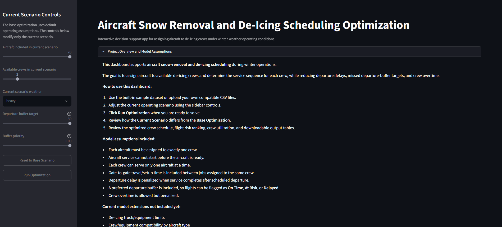
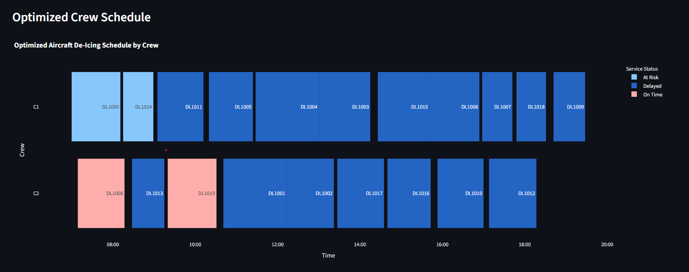
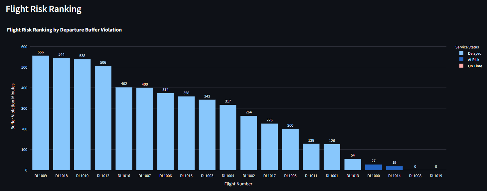
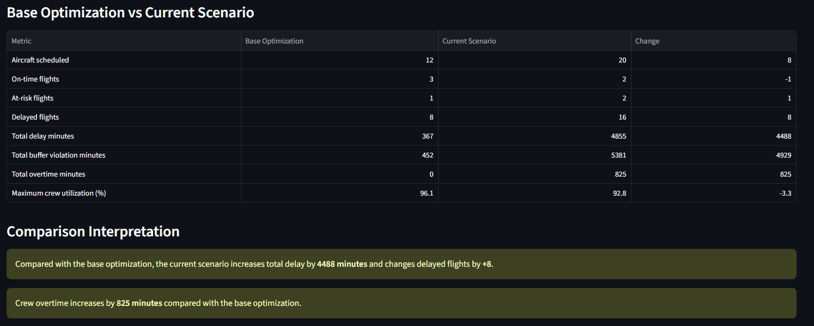

# Aircraft Snow Removal and De-Icing Scheduling Optimization

## Live App

Streamlit dashboard: **[Launch App](PASTE_STREAMLIT_APP_LINK_HERE)**

> Replace the placeholder above with your Streamlit app link after deployment.

---

## Project Overview

This project develops an Operations Research decision-support tool for winter airport ground operations. The goal is to assign aircraft to available snow-removal and de-icing crews while minimizing departure delay, missed departure-buffer targets, and crew overtime.

The project includes:

* Synthetic aircraft de-icing operations data
* Mixed-Integer Linear Programming formulation
* Python implementation using PuLP
* Crew assignment and sequencing optimization
* Departure-delay and buffer-risk analysis
* Scenario analysis for weather severity, fleet volume, and crew availability
* Interactive Streamlit dashboard for stakeholder decision support
* Custom data upload and sample input downloads
* Diagnostic guidance when the model cannot return a usable solution

This project is designed as part of an Operations Research portfolio to demonstrate scheduling optimization, resource assignment, disruption analysis, and stakeholder-facing analytics for the aviation industry.

---

## Dashboard Preview

### Main Dashboard



### Optimized Crew Schedule



### Flight Risk Ranking



### Base vs Current Scenario Comparison



> Add screenshots to the `assets/` folder after final app testing or Streamlit deployment.

---

## Business Problem

During winter weather, aircraft must be cleared of snow and ice before departure. Airports and airlines have limited de-icing crews, limited equipment, travel/setup time between gates, and tight departure schedules.

Operations planners need to answer questions such as:

* Which aircraft should each de-icing crew serve?
* In what order should each crew service assigned aircraft?
* Which flights are likely to be delayed?
* Which flights are at risk because service finishes too close to departure?
* How does heavy snow affect delay and crew utilization?
* What happens if fewer crews are available?
* How much does overtime increase under disrupted conditions?
* How does the current scenario compare with a base operating plan?

The optimization model helps planners create a feasible and efficient de-icing schedule while highlighting operational bottlenecks and delay risk.

---

## Operations Research Model

This project is modeled as a **resource-constrained aircraft de-icing scheduling problem** using a Mixed-Integer Linear Programming formulation.

The model assigns aircraft to crews and sequences aircraft for each crew while accounting for aircraft ready times, scheduled departures, service durations, gate-to-gate travel/setup time, departure-buffer targets, and crew overtime.

---

### Sets

Let:

* $I$ = set of aircraft requiring snow-removal or de-icing service
* $K$ = set of available crews
* $G$ = set of gates or service locations

---

### Parameters

| Parameter   | Description                                                           |
| ----------- | --------------------------------------------------------------------- |
| $r_i$       | Ready time of aircraft $i$                                            |
| $T_i$       | Scheduled departure time of aircraft $i$                              |
| $p_i$       | Service time required for aircraft $i$                                |
| $g_i$       | Gate or service location of aircraft $i$                              |
| $\tau_{ij}$ | Travel/setup time from aircraft $i$ location to aircraft $j$ location |
| $a_k$       | Shift start time of crew $k$                                          |
| $e_k$       | Shift end time of crew $k$                                            |
| $\pi_i$     | Delay penalty per minute for aircraft $i$                             |
| $\gamma_k$  | Overtime cost per minute for crew $k$                                 |
| $H$         | Preferred departure buffer in minutes                                 |
| $\alpha$    | Buffer violation penalty factor                                       |
| $M$         | Large constant used for conditional scheduling constraints            |

The weather condition affects the service time $p_i$. In the synthetic dataset, service times are adjusted using weather multipliers:

| Weather Severity | Multiplier |
| ---------------- | ---------- |
| Light            | 1.0        |
| Moderate         | 1.3        |
| Heavy            | 1.7        |

For example, if an aircraft normally requires 40 minutes of service, then under heavy snow the adjusted service time is:

$$40 \times 1.7 = 68 \text{ minutes}$$

---

### Decision Variables

The aircraft-to-crew assignment variable is:

$$x_{ik} \in {0,1}$$

where:

* $x_{ik} = 1$ if aircraft $i$ is assigned to crew $k$
* $x_{ik} = 0$ otherwise

The sequencing variable is:

$$u_{ijk} \in {0,1}$$

where:

* $u_{ijk} = 1$ if aircraft $i$ is served before aircraft $j$ by crew $k$
* $u_{ijk} = 0$ otherwise

The service start time variable is:

$$s_i \geq 0$$

The service completion time variable is:

$$C_i \geq 0$$

The departure delay variable is:

$$D_i \geq 0$$

The departure-buffer violation variable is:

$$B_i \geq 0$$

The crew overtime variable is:

$$O_k \geq 0$$

---

### Objective Function

The objective is to minimize total operational penalty, including departure delay, departure-buffer violation, and crew overtime:

$$
\min
\left[
\sum_{i \in I} \pi_i D_i
+
\sum_{i \in I} \alpha \pi_i B_i
+
\sum_{k \in K} \gamma_k O_k
\right]
$$

Where:

* $\sum_{i \in I} \pi_i D_i$ penalizes actual departure delay.
* $\sum_{i \in I} \alpha \pi_i B_i$ penalizes aircraft that complete service too close to departure.
* $\sum_{k \in K} \gamma_k O_k$ penalizes crew overtime.

The objective value is displayed in the dashboard as the **Optimization Objective Value**. Lower values are better.

---

### Constraints

Each aircraft must be assigned to exactly one crew:

$$
\sum_{k \in K} x_{ik} = 1
\qquad \forall i \in I
$$

Service cannot start before the aircraft is ready:

$$
s_i \geq r_i
\qquad \forall i \in I
$$

Completion time equals start time plus service duration:

$$
C_i = s_i + p_i
\qquad \forall i \in I
$$

If aircraft $i$ is assigned to crew $k$, service cannot start before the crew shift starts:

$$
s_i \geq a_k - M(1 - x_{ik})
\qquad \forall i \in I,\ \forall k \in K
$$

Departure delay is calculated as the amount of service completion after scheduled departure:

$$
D_i \geq C_i - T_i
\qquad \forall i \in I
$$

$$
D_i \geq 0
\qquad \forall i \in I
$$

Departure-buffer violation is calculated when service completion occurs after the preferred buffer target:

$$
B_i \geq C_i - (T_i - H)
\qquad \forall i \in I
$$

$$
B_i \geq 0
\qquad \forall i \in I
$$

Crew overtime is calculated when an assigned aircraft completes service after the crew shift end:

$$
O_k \geq C_i - e_k - M(1 - x_{ik})
\qquad \forall i \in I,\ \forall k \in K
$$

$$
O_k \geq 0
\qquad \forall k \in K
$$

If two aircraft are assigned to the same crew, one must be served before the other:

$$
u_{ijk} + u_{jik} \geq x_{ik} + x_{jk} - 1
\qquad \forall i,j \in I,\ i \neq j,\ \forall k \in K
$$

The sequencing variable can only activate if both aircraft are assigned to crew $k$:

$$
u_{ijk} \leq x_{ik}
\qquad \forall i,j \in I,\ i \neq j,\ \forall k \in K
$$

$$
u_{ijk} \leq x_{jk}
\qquad \forall i,j \in I,\ i \neq j,\ \forall k \in K
$$

If aircraft $i$ is served before aircraft $j$ by the same crew, then aircraft $j$ cannot start until aircraft $i$ is completed and the crew has completed travel/setup time:

$$
s_j \geq C_i + \tau_{ij} - M(1 - u_{ijk})
\qquad \forall i,j \in I,\ i \neq j,\ \forall k \in K
$$

Decision variables are binary where required:

$$
x_{ik} \in {0,1}
\qquad \forall i \in I,\ \forall k \in K
$$

$$
u_{ijk} \in {0,1}
\qquad \forall i,j \in I,\ i \neq j,\ \forall k \in K
$$

---

## Important Modeling Note

The model allows departure delay, departure-buffer violation, and crew overtime as soft constraints. This means that the model can usually return the best achievable recovery schedule even under disrupted conditions.

For example, if there are too many aircraft and too few crews, the model does not immediately become infeasible. Instead, it may return a schedule with more delay and more overtime.

True infeasibility is more likely to occur because of data or structural issues, such as:

* No available crews
* Missing travel/setup time records
* Invalid service times
* Missing required columns
* Invalid uploaded data
* Inconsistent aircraft, crew, or gate identifiers

This makes the dashboard more useful for operational planning because users can still evaluate difficult scenarios instead of simply receiving a solver failure.

---

## Dataset

The project uses a synthetic airport winter-operations dataset representing aircraft, crews, and gate-to-gate travel/setup times.

### Input Files

| File                    | Description                                          |
| ----------------------- | ---------------------------------------------------- |
| `aircraft_schedule.csv` | Aircraft requiring de-icing or snow-removal service  |
| `crews.csv`             | Available de-icing crews and shift information       |
| `travel_times.csv`      | Travel/setup time between gates or service locations |

---

### Main Input Fields

#### `aircraft_schedule.csv`

| Column                    | Description                                               |
| ------------------------- | --------------------------------------------------------- |
| `aircraft_id`             | Aircraft identifier                                       |
| `flight_number`           | Flight number                                             |
| `scheduled_departure_min` | Scheduled departure time in minutes after midnight        |
| `ready_time_min`          | Earliest time aircraft is ready for service               |
| `aircraft_type`           | Aircraft type or size category                            |
| `service_time_min`        | Required de-icing/snow-removal service time               |
| `gate`                    | Gate or service location                                  |
| `passenger_load`          | Estimated passenger count                                 |
| `priority_score`          | Operational priority score                                |
| `delay_penalty_per_min`   | Delay penalty per minute                                  |
| `weather_severity`        | Weather condition used to generate or adjust service time |

---

#### `crews.csv`

| Column                  | Description                                     |
| ----------------------- | ----------------------------------------------- |
| `crew_id`               | Crew identifier                                 |
| `shift_start_min`       | Crew shift start time in minutes after midnight |
| `shift_end_min`         | Crew shift end time in minutes after midnight   |
| `overtime_cost_per_min` | Overtime cost per minute                        |
| `home_pad`              | Crew starting pad or base location              |

For example:

| Time Field        | Value | Meaning |
| ----------------- | ----- | ------- |
| `shift_start_min` | 420   | 7:00 AM |
| `shift_end_min`   | 960   | 4:00 PM |

The model uses minutes after midnight because it makes time calculations easier in the optimization model.

---

#### `travel_times.csv`

| Column            | Description                          |
| ----------------- | ------------------------------------ |
| `from_location`   | Starting gate or service location    |
| `to_location`     | Destination gate or service location |
| `travel_time_min` | Travel/setup time in minutes         |

---

## Project Workflow

The project follows the workflow below:

1. Generate a synthetic aircraft de-icing dataset.
2. Generate available crew data.
3. Generate gate-to-gate travel/setup times.
4. Formulate and solve a Mixed-Integer Linear Programming model using PuLP.
5. Assign aircraft to crews.
6. Sequence aircraft for each crew.
7. Calculate delay, departure-buffer violation, overtime, and crew utilization.
8. Create interactive Plotly visualizations.
9. Run scenario analysis across weather, crew availability, flight volume, and buffer assumptions.
10. Build an interactive Streamlit dashboard.
11. Allow users to download sample input templates, upload custom files, test current scenarios, and download optimized schedules.

---

## Repository Structure

```text
03_aircraft_deicing_scheduling_optimization/
│
├── app/
│   └── streamlit_app.py
│
├── assets/
│   ├── app_main.png
│   ├── crew_gantt_chart.png
│   ├── flight_risk_ranking.png
│   └── base_vs_current_comparison.png
│
├── data/
│   ├── aircraft_schedule.csv
│   ├── crews.csv
│   └── travel_times.csv
│
├── outputs/
│   ├── optimized_schedule.csv
│   ├── crew_summary.csv
│   ├── flight_delay_summary.csv
│   ├── scenario_comparison.csv
│   ├── crew_gantt_chart.html
│   ├── flight_risk_ranking_chart.html
│   ├── delay_summary_chart.html
│   ├── crew_utilization_chart.html
│   ├── scenario_comparison_chart.html
│   ├── scenario_delay_buffer_chart.html
│   ├── scenario_overtime_chart.html
│   └── scenarios/
│
├── src/
│   ├── generate_data.py
│   ├── solve_model.py
│   ├── scenario_analysis.py
│   ├── visualize_results.py
│   └── utils.py
│
├── README.md
└── requirements.txt
```

---

## Scenario Analysis

Scenario analysis was used to evaluate how the aircraft de-icing plan changes under different winter-operation conditions.

### Tested Scenarios

| Scenario                  | Description                                                                                      |
| ------------------------- | ------------------------------------------------------------------------------------------------ |
| Base Case                 | Moderate weather, default aircraft volume, default crew availability, 10-minute departure buffer |
| Heavy Snow                | Service times increase under heavy weather                                                       |
| Reduced Crew Availability | Fewer available crews                                                                            |
| High Flight Volume        | More aircraft included in the scheduling window                                                  |
| Tight Departure Buffer    | Larger preferred buffer before departure                                                         |

---

### Scenario Results

| Scenario                  | Aircraft | Crews | On Time | At Risk | Delayed | Total Delay | Buffer Violation | Overtime | Objective |
| ------------------------- | -------: | ----: | ------: | ------: | ------: | ----------: | ---------------: | -------: | --------: |
| Base Case                 |       12 |     3 |       5 |       2 |       5 |         141 |              205 |        0 |  2,046.60 |
| Heavy Snow                |       12 |     3 |       2 |       1 |       9 |         473 |              570 |        0 |  6,697.83 |
| Reduced Crew Availability |       12 |     2 |       2 |       0 |      10 |         679 |              779 |       67 |  8,865.59 |
| High Flight Volume        |       16 |     3 |       5 |       0 |      11 |         570 |              680 |       18 |  7,276.68 |
| Tight Departure Buffer    |       12 |     3 |       3 |       5 |       4 |         146 |              277 |        0 |  2,252.58 |

---

### Key Findings

* The base case produced 141 total delay minutes and no crew overtime.
* Heavy snow significantly increased delay because aircraft service times became longer.
* Reduced crew availability produced the highest total operational penalty among the tested scenarios.
* High flight volume increased delay and introduced crew overtime.
* Tightening the departure buffer increased at-risk flights and total buffer violation.
* Crew utilization is a useful bottleneck indicator because crews near full utilization leave little operational slack.

---

## Streamlit Dashboard

The project includes an interactive Streamlit dashboard for stakeholder-facing scenario analysis.

### Dashboard Features

The dashboard allows users to:

* Use the sample dataset
* Upload custom aircraft, crew, and travel-time CSV files
* Download sample input templates
* Preview base and current-scenario input data
* Adjust aircraft volume in the current scenario
* Adjust available crews
* Adjust weather severity
* Adjust the preferred departure buffer
* Adjust the buffer-priority factor
* Reset controls to the base scenario
* Run optimization only when the user clicks a button
* Compare base optimization against the current scenario
* View the current optimized crew schedule
* View flight risk ranking
* View crew utilization
* Download optimized schedule outputs
* Receive diagnostic guidance if no usable solution is returned

---

### Base Optimization vs Current Scenario

The dashboard solves the base optimization internally and compares it against the selected current scenario.

The base optimization uses default assumptions:

| Setting            | Base Value |
| ------------------ | ---------- |
| Aircraft scheduled | 12         |
| Crews available    | 3          |
| Weather            | Moderate   |
| Departure buffer   | 10 minutes |
| Buffer priority    | 0.25       |

The current scenario uses the values selected by the user in the sidebar.

Only the current optimized schedule is shown in detail to avoid repetitive results. A comparison table summarizes how the current scenario differs from the base optimization.

---

### Gantt Chart Interpretation

The optimized crew schedule is shown as a Gantt chart.

The colored bars represent aircraft service time.

Blank space between jobs for the same crew can include:

* Travel/setup time between gates
* Waiting time before the next aircraft is ready
* Operational slack

Crew breaks are not currently modeled. Therefore, blank space should not be interpreted as a formal break.

A possible future enhancement is to explicitly visualize travel/setup time as a separate gray bar between service jobs.

---

### Diagnostic Guidance

Because delay, buffer violation, and overtime are modeled as soft constraints, the model usually returns a feasible schedule even under difficult operating conditions.

If the model does not return a usable solution, the dashboard provides diagnostic guidance related to:

* Number of aircraft
* Number of crews
* Total service workload
* Total regular crew time
* Departure-buffer target
* Weather condition
* Missing or invalid input data

Recommended adjustments may include:

* Increase available crews
* Reduce aircraft volume
* Use a smaller departure buffer
* Test lighter weather assumptions
* Review service-time assumptions
* Check uploaded CSV formatting

---

## Output Files

| Output File                                | Description                                 |
| ------------------------------------------ | ------------------------------------------- |
| `outputs/optimized_schedule.csv`           | Aircraft-level optimized schedule           |
| `outputs/crew_summary.csv`                 | Crew-level utilization and overtime summary |
| `outputs/flight_delay_summary.csv`         | Flight delay and buffer-risk summary        |
| `outputs/scenario_comparison.csv`          | Scenario comparison table                   |
| `outputs/crew_gantt_chart.html`            | Interactive optimized crew schedule         |
| `outputs/flight_risk_ranking_chart.html`   | Flight risk ranking visualization           |
| `outputs/crew_utilization_chart.html`      | Crew utilization visualization              |
| `outputs/scenario_comparison_chart.html`   | Scenario-level service status comparison    |
| `outputs/scenario_delay_buffer_chart.html` | Scenario delay and buffer comparison        |
| `outputs/scenario_overtime_chart.html`     | Scenario overtime comparison                |

---

## How to Run the Project

### 1. Clone or open the repository

```bash
cd 03_aircraft_deicing_scheduling_optimization
```

### 2. Install dependencies

```bash
pip install -r requirements.txt
```

### 3. Generate the synthetic dataset

```bash
python src/generate_data.py
```

### 4. Solve the base scheduling model

```bash
python src/solve_model.py
```

### 5. Run scenario analysis

```bash
python src/scenario_analysis.py
```

### 6. Create visualizations

```bash
python src/visualize_results.py
```

### 7. Launch the Streamlit dashboard

```bash
streamlit run app/streamlit_app.py
```

---

## Requirements

```text
pandas
numpy
pulp
streamlit
plotly
openpyxl
matplotlib
```

---

## Tools and Libraries

| Tool       | Purpose                                          |
| ---------- | ------------------------------------------------ |
| Python     | Core programming language                        |
| Pandas     | Data processing                                  |
| PuLP       | Mixed-Integer Linear Programming model           |
| CBC Solver | MILP solver used through PuLP                    |
| Plotly     | Interactive schedule and scenario visualizations |
| Streamlit  | Interactive decision-support dashboard           |
| CSV        | Input and output data format                     |

---

## Example Business Interpretation

The scenario analysis shows that winter airport de-icing operations become highly sensitive to weather severity and crew availability. Under heavy snow, service times increase and more flights become delayed. Under reduced crew availability, the system experiences both higher delay and crew overtime, suggesting that crew staffing is a major operational bottleneck.

The optimization model helps planners compare the base operating plan against current disruptions and identify whether the main issue is flight volume, severe weather, limited crews, or tight departure-buffer requirements.

---

## Resume Bullet Drafts

* Developed a MILP-based aircraft de-icing and snow-removal scheduling model using PuLP to assign aircraft to limited crews under ready-time, departure-buffer, sequencing, travel-time, and overtime constraints.
* Built an interactive Streamlit decision-support dashboard allowing stakeholders to test weather severity, aircraft volume, crew availability, and departure-buffer scenarios with custom data upload and downloadable optimized schedules.
* Conducted scenario analysis across winter disruption conditions, identifying reduced crew availability and heavy snow as the largest drivers of simulated delay, buffer violation, and overtime.

---

## Project Status

Completed core project components:

* Synthetic aircraft schedule generation
* Crew and travel-time data generation
* MILP scheduling model
* Aircraft-to-crew assignment
* Crew-level sequencing constraints
* Departure delay calculation
* Departure-buffer violation calculation
* Crew overtime calculation
* Scenario analysis
* Interactive Plotly visualizations
* Streamlit dashboard
* Sample data downloads
* Custom data upload
* Base optimization vs current scenario comparison
* Diagnostic guidance
* Downloadable optimized outputs

Next possible extensions:

* Add explicit de-icing truck/equipment capacity
* Add crew/equipment compatibility by aircraft type
* Add de-icing pad capacity constraints
* Add fluid holdover-time expiration logic
* Add crew break rules
* Add weather severity that changes over time
* Add cancellation or deferral decisions
* Add explicit travel/setup bars to the Gantt chart
* Add scheduling-window selection by departure time range
* Deploy the Streamlit app online
