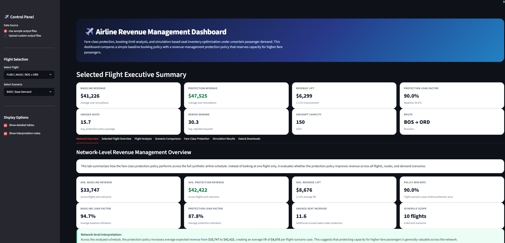
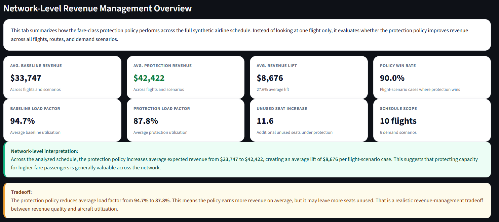
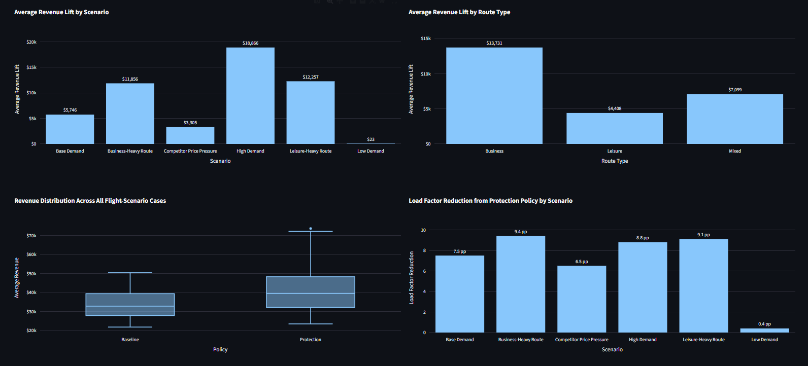
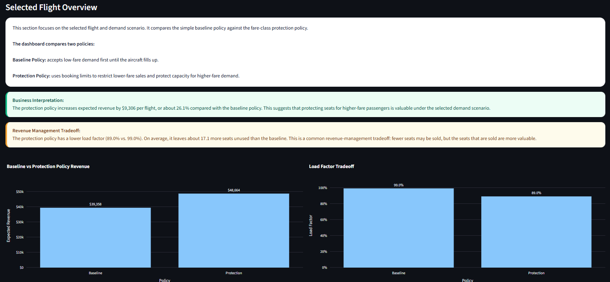
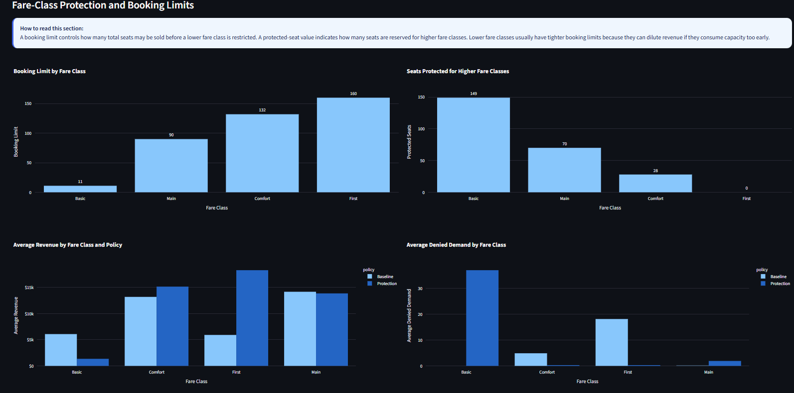
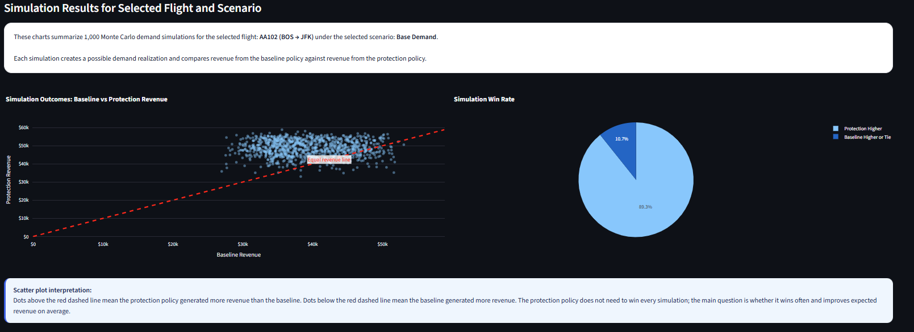

# Airline Revenue Management: Fare-Class Protection and Seat Inventory Optimization

## Project Overview

This project presents an airline revenue management decision-support tool for evaluating fare-class booking limits, seat protection policies, and revenue tradeoffs under uncertain passenger demand.

Airlines sell seats through multiple fare classes, such as Basic, Main, Comfort, and First. Lower-fare passengers often book earlier, while higher-fare passengers may book later. Since aircraft capacity is limited, the airline needs to decide how much inventory should remain available for higher-fare demand instead of allowing early low-fare bookings to consume all seats.

This project compares a simple baseline booking policy against a fare-class protection policy using synthetic airline booking data, optimization logic, protection-level modeling, and Monte Carlo simulation.

## Live App

[Open Streamlit App](https://operations-research-portfolio-upppmagssubzaexxcj9qgj.streamlit.app/)

## Business Problem

Airline revenue management teams need to answer questions such as:

* How many seats should be made available to lower-fare classes?
* How many seats should be protected for higher-fare passengers?
* How does the protection policy perform under different demand scenarios?
* What is the tradeoff between higher revenue and lower load factor?
* Which flights or scenarios benefit most from fare-class protection?

The goal is to maximize expected revenue while understanding the operational tradeoffs related to unused seats, denied demand, and load factor.

## Methods Used

This project combines optimization logic, seat protection rules, and simulation-based evaluation.

Main methods include:

* Fare-class seat inventory modeling
* Booking-limit and protection-level logic
* Expected revenue comparison
* Monte Carlo demand simulation
* Scenario analysis
* Baseline vs protection policy comparison
* Interactive Streamlit dashboard

## Dataset

The project uses synthetic airline revenue management data.

Input files:

| File                    | Description                                                                                         |
| ----------------------- | --------------------------------------------------------------------------------------------------- |
| `flights.csv`           | Flight schedule, route, aircraft type, capacity, and route type                                     |
| `fare_classes.csv`      | Fare-class definitions and base fares                                                               |
| `demand_forecasts.csv`  | Forecasted demand, demand uncertainty, cancellation rate, and no-show rate by flight and fare class |
| `booking_scenarios.csv` | Demand, price, and uncertainty multipliers for different business scenarios                         |

Generated output files:

| File                               | Description                                                            |
| ---------------------------------- | ---------------------------------------------------------------------- |
| `optimized_seat_allocations.csv`   | Deterministic fare-class seat allocation results                       |
| `scenario_results.csv`             | Baseline vs deterministic optimization summary                         |
| `protection_levels.csv`            | Booking limits and protected seats by flight, scenario, and fare class |
| `protection_policy_results.csv`    | Expected sales and revenue from the protection policy                  |
| `protection_policy_summary.csv`    | Flight-scenario-level protection policy summary                        |
| `simulated_revenue_results.csv`    | Simulation-level baseline vs protection revenue results                |
| `simulated_fare_class_results.csv` | Fare-class-level simulation results                                    |
| `simulated_policy_summary.csv`     | Final dashboard-ready policy comparison summary                        |


## Dashboard Screenshots

### App Overview



### Network Overview



### Network-Level Scenario Insights



### Selected Flight Overview



### Fare-Class Protection



### Simulation Results




## Modeling Approach

This project includes three connected modeling layers:

1. A deterministic fare-class seat allocation model
2. A fare-class protection and booking-limit policy
3. A Monte Carlo simulation model for evaluating policy performance under uncertain demand

Together, these layers demonstrate both mathematical optimization and practical airline revenue-management decision support.

# Operations Research Modeling Formulation

## Sets and Indices

| Symbol    | Description                                |
| --------- | ------------------------------------------ |
| $f \in F$ | Set of flights                             |
| $c \in C$ | Set of fare classes                        |
| $s \in S$ | Set of demand/pricing scenarios            |
| $m \in M$ | Set of Monte Carlo simulation replications |

Fare classes are ordered from lowest to highest fare:

$$
Basic < Main < Comfort < First
$$

For each fare class $c$, define:

$$
H(c) = {j \in C : j \text{ has a higher fare rank than } c}
$$

where $H(c)$ is the set of fare classes that are higher than fare class $c$.

## Input Parameters

| Symbol            | Description                                                            |
| ----------------- | ---------------------------------------------------------------------- |
| $K_f$             | Seat capacity of flight $f$                                            |
| $p_{fcs}$         | Fare price for flight $f$, fare class $c$, scenario $s$                |
| $\mu_{fcs}$       | Forecasted demand for flight $f$, fare class $c$, scenario $s$         |
| $\sigma_{fcs}$    | Demand standard deviation for flight $f$, fare class $c$, scenario $s$ |
| $r^{cancel}_{fc}$ | Cancellation rate for flight $f$, fare class $c$                       |
| $r^{noshow}_{fc}$ | No-show rate for flight $f$, fare class $c$                            |
| $q_s$             | Scenario-specific demand multiplier                                    |
| $g_s$             | Scenario-specific price multiplier                                     |
| $u_s$             | Scenario-specific uncertainty multiplier                               |

Scenario-adjusted fare price is calculated as:

$$
p_{fcs} = p_{fc} \cdot g_s
$$

Scenario-adjusted demand is calculated as:

$$
\mu_{fcs} = \mu_{fc} \cdot q_s
$$

Scenario-adjusted demand uncertainty is calculated as:

$$
\sigma_{fcs} = \sigma_{fc} \cdot u_s
$$

## 1. Deterministic Seat Allocation Model

The first modeling layer is a deterministic capacity-allocation model. It assigns available aircraft seats across fare classes to maximize expected revenue.

This model is useful as an optimization benchmark, but it does not fully represent real airline revenue management because it assumes demand is known and seats can be directly allocated to fare classes.

### Decision Variable

$$
x_{fcs} = \text{number of seats allocated to fare class } c \text{ on flight } f \text{ under scenario } s
$$

where:

$$
x_{fcs} \in \mathbb{Z}_{+}
$$

### Objective Function

Maximize total expected revenue:

$$
\max \sum_{c \in C} p_{fcs} x_{fcs}
$$

This objective prioritizes allocating limited seat capacity to higher-revenue fare classes while respecting demand and capacity limits.

### Constraints

#### Aircraft Capacity Constraint

The total number of allocated seats cannot exceed aircraft capacity:

$$
\sum_{c \in C} x_{fcs} \leq K_f
$$

#### Fare-Class Demand Constraint

The number of allocated seats for each fare class cannot exceed forecasted demand:

$$
x_{fcs} \leq \mu_{fcs} \quad \forall c \in C
$$

#### Non-Negativity and Integrality

$$
x_{fcs} \geq 0
$$

$$
x_{fcs} \in \mathbb{Z}_{+}
$$

### Deterministic Model Interpretation

This model answers:

> If demand forecasts are fixed, how many seats should be assigned to each fare class to maximize expected revenue?

However, in real airline revenue management, airlines do not usually reserve a fixed number of physical seats for each fare class. Instead, they control seat availability through booking limits and protection levels. Therefore, this project extends the deterministic model with a protection policy.

## 2. Fare-Class Protection and Booking-Limit Policy

The second modeling layer calculates booking limits for lower-fare classes and protects seats for higher-fare passengers who may book later.

This is closer to airline revenue-management logic because lower-fare demand often arrives earlier, while higher-fare demand may arrive closer to departure.

### Protection-Level Logic

For each fare class $c$, the model estimates how many seats should be protected for all higher fare classes $H(c)$.

The aggregate expected demand from higher fare classes is:

$$
\mu^{H}*{fcs} = \sum*{j \in H(c)} \mu_{fjs}
$$

Assuming independent demand across fare classes, the aggregate demand uncertainty for higher fare classes is:

$$
\sigma^{H}*{fcs} = \sqrt{\sum*{j \in H(c)} \sigma_{fjs}^{2}}
$$

The weighted average fare of higher fare classes is:

$$
\bar{p}^{H}*{fcs} =
\frac{\sum*{j \in H(c)} p_{fjs}\mu_{fjs}}
{\sum_{j \in H(c)} \mu_{fjs}}
$$

The critical ratio used for protection is:

$$
\alpha_{fcs} = 1 - \frac{p_{fcs}}{\bar{p}^{H}_{fcs}}
$$

The protection level is calculated as:

$$
y_{fcs} =
\mu^{H}*{fcs} + \Phi^{-1}(\alpha*{fcs})\sigma^{H}_{fcs}
$$

where:

| Symbol         | Description                                               |
| -------------- | --------------------------------------------------------- |
| $y_{fcs}$      | Number of seats protected for higher fare classes         |
| $\Phi^{-1}$    | Inverse standard normal cumulative distribution function  |
| $\alpha_{fcs}$ | Critical ratio comparing the current fare to higher fares |

The protection level is bounded by aircraft capacity:

$$
0 \leq y_{fcs} \leq K_f
$$

### Booking Limit

The booking limit for fare class $c$ is:

$$
b_{fcs} = K_f - y_{fcs}
$$

where:

| Symbol    | Description                                                                  |
| --------- | ---------------------------------------------------------------------------- |
| $b_{fcs}$ | Maximum number of seats that may be sold before fare class $c$ is restricted |
| $K_f$     | Aircraft capacity                                                            |
| $y_{fcs}$ | Seats protected for higher fare classes                                      |

### Booking Limit Interpretation

For example, if an aircraft has 150 seats and the model returns:

```text
Basic booking limit = 80
Main booking limit = 115
Comfort booking limit = 140
First booking limit = 150
```

then the interpretation is:

* Basic fares can be sold only until 80 total seats have been booked.
* Main fares can be sold until 115 total seats have been booked.
* Comfort fares can be sold until 140 total seats have been booked.
* First class can use the remaining available capacity.

This prevents early low-fare demand from consuming too much capacity before higher-fare demand arrives.

## 3. Simulation-Based Revenue Evaluation

The third modeling layer evaluates the baseline and protection policies under uncertain demand.

Instead of assuming demand is fixed, the model generates many possible demand realizations using Monte Carlo simulation.

### Random Demand Generation

For each simulation replication $m$, realized demand is generated as:

$$
D_{fcsm} \sim \max(0, Normal(\mu_{fcs}, \sigma_{fcs}))
$$

Demand is then adjusted for cancellation and no-show assumptions:

$$
\tilde{D}*{fcsm} =
D*{fcsm}(1-r^{cancel}*{fc})(1-r^{noshow}*{fc})
$$

where:

| Symbol             | Description                                                |
| ------------------ | ---------------------------------------------------------- |
| $D_{fcsm}$         | Raw simulated demand                                       |
| $\tilde{D}_{fcsm}$ | Effective realized demand after cancellations and no-shows |
| $r^{cancel}_{fc}$  | Cancellation rate                                          |
| $r^{noshow}_{fc}$  | No-show rate                                               |

### Baseline Booking Policy

The baseline policy represents a simple first-come-first-served approach.

Lower-fare demand is accepted first until the aircraft reaches capacity.

Let:

$$
a^{B}_{fcsm}
$$

be the number of accepted bookings under the baseline policy.

The baseline policy satisfies:

$$
\sum_{c \in C} a^{B}_{fcsm} \leq K_f
$$

$$
0 \leq a^{B}*{fcsm} \leq \tilde{D}*{fcsm}
$$

Baseline revenue is:

$$
R^{B}*{fsm} = \sum*{c \in C} p_{fcs} a^{B}_{fcsm}
$$

The baseline policy can fill the aircraft quickly, but it may accept too much low-fare demand and leave no seats available for later high-fare passengers.

### Protection Booking Policy

The protection policy uses booking limits to restrict lower-fare bookings.

Let:

$$
a^{P}_{fcsm}
$$

be the number of accepted bookings under the protection policy.

The total accepted bookings must satisfy:

$$
\sum_{c \in C} a^{P}_{fcsm} \leq K_f
$$

Each accepted fare-class demand cannot exceed realized demand:

$$
0 \leq a^{P}*{fcsm} \leq \tilde{D}*{fcsm}
$$

For lower fare classes, cumulative accepted bookings are limited by booking limits:

$$
\sum_{j: rank(j) \leq rank(c)} a^{P}*{fjsm} \leq b*{fcs}
$$

This prevents lower-fare classes from exceeding the booking limits created by the protection-level model.

Protection-policy revenue is:

$$
R^{P}*{fsm} = \sum*{c \in C} p_{fcs} a^{P}_{fcsm}
$$

## 4. Performance Metrics

The model compares the baseline and protection policies using several revenue-management metrics.

### Revenue Lift

$$
Lift_{fsm} = R^{P}*{fsm} - R^{B}*{fsm}
$$

### Revenue Lift Percentage

$$
LiftPct_{fsm} =
\frac{R^{P}*{fsm} - R^{B}*{fsm}}{R^{B}_{fsm}} \times 100
$$

### Load Factor

Baseline load factor:

$$
LF^{B}*{fsm} =
\frac{\sum*{c \in C} a^{B}_{fcsm}}{K_f}
$$

Protection load factor:

$$
LF^{P}*{fsm} =
\frac{\sum*{c \in C} a^{P}_{fcsm}}{K_f}
$$

### Unused Seats

Baseline unused seats:

$$
U^{B}*{fsm} =
K_f - \sum*{c \in C} a^{B}_{fcsm}
$$

Protection unused seats:

$$
U^{P}*{fsm} =
K_f - \sum*{c \in C} a^{P}_{fcsm}
$$

### Denied Demand

Baseline denied demand:

$$
Denied^{B}*{fsm} =
\sum*{c \in C} \max(0, \tilde{D}*{fcsm} - a^{B}*{fcsm})
$$

Protection denied demand:

$$
Denied^{P}*{fsm} =
\sum*{c \in C} \max(0, \tilde{D}*{fcsm} - a^{P}*{fcsm})
$$

### Policy Win Rate

The protection policy is considered to win a simulation if:

$$
R^{P}*{fsm} > R^{B}*{fsm}
$$

The policy win rate is:

$$
WinRate =
\frac{
\sum_{f \in F}\sum_{s \in S}\sum_{m \in M}
I(R^{P}*{fsm} > R^{B}*{fsm})
}{
|F||S||M|
}
$$

where $I(\cdot)$ is an indicator function.

## 5. Overall Modeling Workflow

The complete modeling workflow is:

```text
1. Generate synthetic flight, fare, and demand data
2. Adjust demand and prices by scenario
3. Solve deterministic seat-allocation optimization model
4. Calculate fare-class protection levels and booking limits
5. Simulate uncertain demand across many replications
6. Apply baseline policy and protection policy
7. Compare revenue, load factor, unused seats, and denied demand
8. Display results in an interactive Streamlit dashboard
```

## 6. Business Interpretation of the Model

The protection policy is designed to answer:

> Should the airline reject some early low-fare demand to preserve seats for later high-fare demand?

A successful protection policy may produce:

* Higher expected revenue
* Lower load factor
* More unused seats
* More denied low-fare demand
* Better seat availability for high-fare customers

This is a realistic airline revenue-management tradeoff. The objective is not always to fill every seat. The objective is to maximize expected revenue from limited seat capacity.

In this project, the protection policy is evaluated not only by whether it increases revenue in one deterministic scenario, but by whether it performs better on average across uncertain demand simulations.

## Dashboard Features

The Streamlit dashboard includes:

* Network-level revenue management overview
* Selected flight and scenario analysis
* Baseline vs protection policy comparison
* Revenue lift and load factor KPIs
* Fare-class booking-limit charts
* Protected-seat charts
* Scenario comparison charts
* Monte Carlo simulation distributions
* Simulation win-rate analysis
* Data preview and download options
* Upload option for custom output files

## Key Dashboard Tabs

| Tab                      | Purpose                                                           |
| ------------------------ | ----------------------------------------------------------------- |
| Network Overview         | Shows overall policy performance across all flights and scenarios |
| Selected Flight Overview | Summarizes the selected flight and scenario                       |
| Flight Analysis          | Shows revenue distribution and seat-utilization tradeoffs         |
| Scenario Comparison      | Compares the selected flight across all demand scenarios          |
| Fare-Class Protection    | Shows booking limits, protected seats, and fare-class outcomes    |
| Simulation Results       | Shows simulation-level baseline vs protection outcomes            |
| Data & Downloads         | Allows users to preview and download output files                 |

## Example Business Interpretation

The protection policy can increase expected revenue even when it lowers load factor.

This happens because the model intentionally rejects some lower-fare demand to preserve seats for higher-fare passengers. As a result, the aircraft may have more unused seats, but the seats that are sold generate higher revenue.

This creates a realistic airline revenue-management tradeoff:

```text
Revenue maximization vs. load factor vs. unused seats vs. denied demand
```

## How to Run the Project

### 1. Create the Conda Environment

```bash
conda create -n airline_revenue_management python=3.11
conda activate airline_revenue_management
```

### 2. Install Required Packages

```bash
pip install pandas numpy matplotlib plotly streamlit pulp openpyxl scipy
```

Or install from `requirements.txt`:

```bash
pip install -r requirements.txt
```

### 3. Generate Synthetic Data

```bash
python src/generate_data.py
```

### 4. Run the Deterministic Optimization Model

```bash
python src/optimization_model.py
```

### 5. Run the Protection-Level Model

```bash
python src/protection_level_model.py
```

### 6. Run Scenario Analysis

```bash
python src/scenario_analysis.py
```

### 7. Run the Simulation-Based Revenue Model

```bash
python src/simulation_revenue_model.py
```

### 8. Launch the Streamlit App

```bash
streamlit run app/streamlit_app.py
```

## Requirements

```text
pandas
numpy
matplotlib
plotly
streamlit
pulp
openpyxl
scipy
```

## Sample Results

The simulation-based model compares baseline and protection policies across all flights and scenarios.

Example output metrics include:

* Average baseline revenue
* Average protection-policy revenue
* Revenue lift
* Revenue lift percentage
* Baseline load factor
* Protection-policy load factor
* Unused seats
* Denied demand
* Protection win rate

A typical result is that the protection policy improves expected revenue while reducing load factor. This means the policy sells fewer seats on average but sells a more valuable mix of seats.

## Limitations

This is a portfolio project using synthetic data. It is designed to demonstrate revenue management logic, optimization thinking, simulation modeling, and stakeholder-facing dashboard development.

It is not a production airline revenue management system.

The model does not include:

* Dynamic time-to-departure booking curves
* Continuous fare updates
* Overbooking optimization
* Connecting passengers
* Network revenue displacement
* Loyalty status or customer segmentation
* Competitor price-response modeling
* Real historical booking data

However, the project captures the core OR logic behind airline seat inventory control:

```text
Limited capacity + multiple fare classes + uncertain demand + booking limits + revenue tradeoffs
```

## Project Structure

```text
04_airline_revenue_management/
│
├── app/
│   └── streamlit_app.py
│
├── data/
│   ├── flights.csv
│   ├── fare_classes.csv
│   ├── demand_forecasts.csv
│   └── booking_scenarios.csv
│
├── outputs/
│   ├── optimized_seat_allocations.csv
│   ├── scenario_results.csv
│   ├── protection_levels.csv
│   ├── protection_policy_results.csv
│   ├── protection_policy_summary.csv
│   ├── simulated_revenue_results.csv
│   ├── simulated_fare_class_results.csv
│   └── simulated_policy_summary.csv
│
├── screenshots/
│   ├── 00_app_overview.png
│   ├── 01_network_overview.png
│   ├── 02_network_charts.png
│   ├── 03_selected_flight_overview.png
│   ├── 04_fare_class_protection.png
│   ├── 05_simulation_results.png
│   └── 06_data_downloads.png
│
├── src/
│   ├── generate_data.py
│   ├── optimization_model.py
│   ├── protection_level_model.py
│   ├── scenario_analysis.py
│   └── simulation_revenue_model.py
│
├── requirements.txt
└── README.md
```


## Possible Future Extensions

Potential extensions include:

* Add time periods before departure
* Update protection levels dynamically as bookings arrive
* Add overbooking decisions
* Include cancellation and no-show optimization
* Add route-level demand forecasting
* Add competitor fare response
* Compare EMSR-a and EMSR-b protection policies
* Add customer choice modeling
* Integrate real airline booking curves
* Extend from single-leg revenue management to network revenue management

